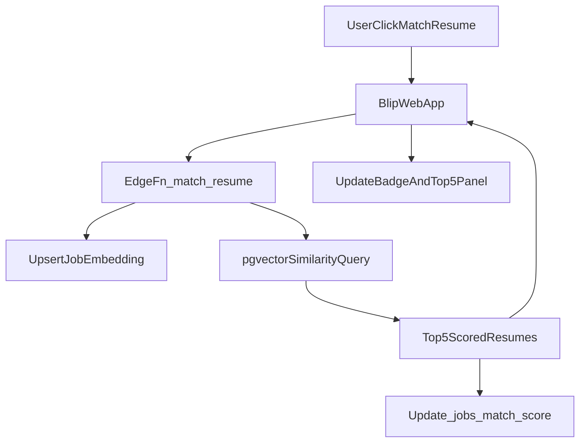

# Blip: Match Resume buttons + Supabase Edge match service

## Decisions locked in

- **Runtime**: Supabase Edge Functions.
- **Embeddings**: Supabase AI quickstart constraint (provider/model: `gte-small`).

## What will change

### Product/PRD updates

- Update `documents/extension/PRD.md` to:
  - Add the **web app “Match Resume” buttons** spec (JobCard + JobDetailModal) and the **top-5 scored results** requirement.
  - Replace placeholder embedding model notes with `**gte-small`** and its vector dimension (we’ll set `vector(<dims>)` accordingly).
  - Clarify the **canonical role link** fields: current page URL + optional “actual role URL” (esp. LinkedIn).
  - Fix the Windows encoding artifacts currently present in the doc around quoted strings (the `�` characters).

### Supabase schema (migrations)

- Add a migration under `supabase/migrations/` to:
  - `CREATE EXTENSION IF NOT EXISTS vector;`
  - Create tables:
    - `public.resume_versions` (user-owned resume metadata + storage path + extracted text + embedding status)
    - `public.resume_version_embeddings` (embedding vector + model + updated_at)
    - `public.job_embeddings` (embedding vector + model + updated_at)
  - Add `public.jobs.match_score_updated_at`.
  - Add RLS policies so users can only read/write their own resume rows; embeddings rows inherit via FK.

### Edge Functions

- Create Supabase Edge Functions (under `supabase/functions/` if this repo uses the standard layout):
  - `process-resume`
    - Inputs: `resume_version_id`
    - Downloads the PDF from Storage, extracts text, generates embedding (`gte-small`), upserts embedding, marks status `ready`.
  - `match-resume`
    - Inputs: `job_id`
    - Ensures a job embedding exists (generate if missing/stale), runs vector similarity against the user’s resume embeddings, computes hybrid score, returns **top 5**, and updates `jobs.match_score` + `jobs.match_score_updated_at`.

### Web app UI

- Add a **Match** button in two places:
  - `src/components/JobCard.tsx`
    - Add a small hover action button near the existing copy button.
    - On click: call `match-resume` edge function; update local job state so `MatchScoreBadge` reflects the new `match_score`.
  - `src/components/JobDetailModal.tsx`
    - Add a “Match Resume” button in the header/action area.
    - Show a **Top 5 results** panel in the modal with labels + scores + missing keywords.

### Shared client service

- Add a small client wrapper (e.g. `src/services/match.ts`) to call the edge function via Supabase (`supabase.functions.invoke`) and normalize the response.

## Data flow (end-to-end)

## Verification

- Run the app and confirm:
  - Clicking **Match** updates `MatchScoreBadge`.
  - JobDetailModal shows **top 5** results.
  - No resumes → UX nudges to upload.
- Confirm RLS prevents cross-user resume reads.

