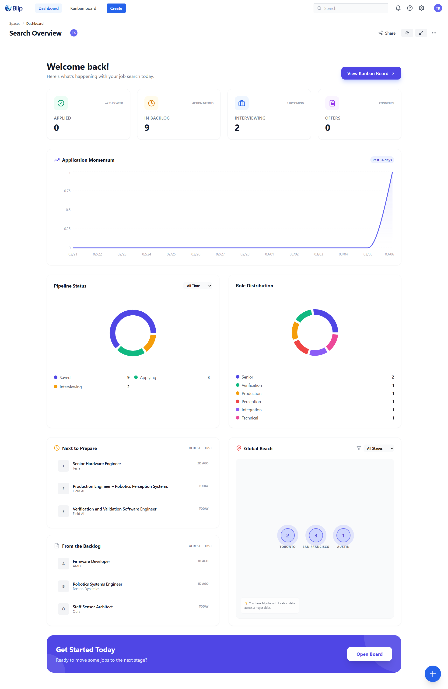
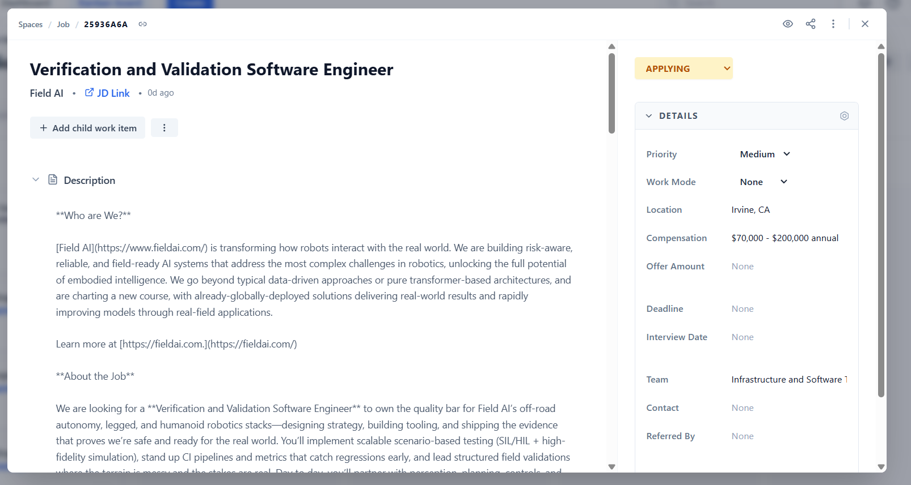
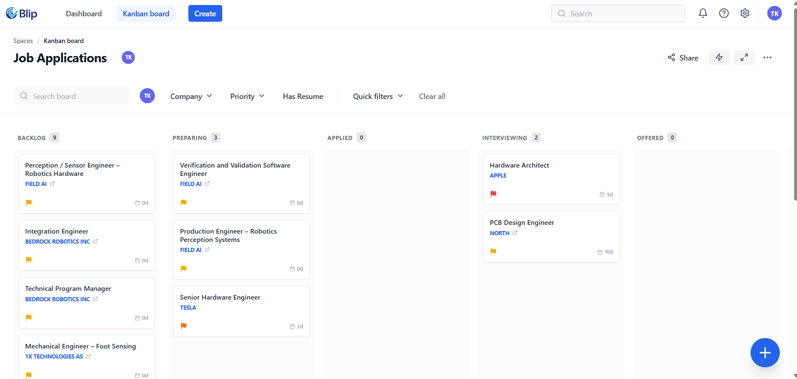

# Blip

**The Ultimate Job Application Tracker & Automation Engine**

Blip is a high-performance, Jira-inspired job hunting dashboard designed to take the friction out of the "applying" phase. Stop juggling spreadsheets and start managing your career search like a pro.

---

## Preview

| Dashboard | Job Details | Kanban Board |
| :---: | :---: | :---: |
|  |  |  |

---

## Features

- **Smart Scraping Engine**: Powered by Firecrawl. Paste a job URL and watch Blip extract the title, company, description, and salary details automatically.
- **Jira-Style Kanban Board**: Drag-and-drop your applications through stages. From "Backlog" to "Offer", keep your pipeline organized.
- **Real-time Analytics**: A dedicated dashboard featuring success rate donuts, application timelines, and role distribution charts.
- **Background Processing**: A dedicated worker handles scraping jobs concurrently, ensuring your UI stays snappy.
- **Profile Management**: Store your resume links, cover letters, and career preferences in one secure place.
- **Global Reach**: integrated city/country lookups for accurate job location tracking.

---

## Tech Stack

- **Core**: [React 18](https://reactjs.org/) + [TypeScript](https://www.typescriptlang.org/)
- **Build Tool**: [Vite](https://vitejs.dev/)
- **Backend/Auth**: [Supabase](https://supabase.com/) (PostgreSQL + RLS)
- **Styling**: [Tailwind CSS](https://tailwindcss.com/)
- **Animations**: [Framer Motion](https://www.framer.com/motion/)
- **Data Viz**: [Recharts](https://recharts.org/)
- **Icons**: [Lucide React](https://lucide.dev/)

---

## Getting Started

### 1. Prerequisites
- Node.js (v18 or higher)
- A Supabase account (or local Supabase CLI)
- A [Firecrawl](https://firecrawl.dev/) API Key

### 2. Installation
```bash
git clone https://github.com/adiravishankara/blip.git
cd blip
npm install
```

### 3. Environment Variables
Create a `.env.local` file in the root:
```env
VITE_SUPABASE_URL=your_project_url
VITE_SUPABASE_ANON_KEY=your_anon_key
VITE_FIRECRAWL_API_KEY=your_firecrawl_api_key
```

### 4. Database Setup (Supabase)
This project relies on several PostgreSQL tables and RLS policies.

**Option A: Local Development (Recommended)**
```bash
npx supabase start
```
The CLI will automatically apply all migrations in `./supabase/migrations`.

**Option B: Supabase Dashboard**
Apply the SQL migrations found in `supabase/migrations/` in chronological order using the SQL Editor in your Supabase dashboard.

### 5. Start Developing
```bash
npm run dev
```

### 6. Docker (Full Stack)
To run Supabase, Firecrawl, Ollama, and the frontend together with Docker, see [DOCKER.md](./DOCKER.md).

---

## Project Structure

- `/src/components`: UI components (Modals, Kanban, Dashboard)
- `/src/hooks`: Custom React hooks for business logic
- `/src/lib`: Supabase client configuration
- `/supabase/migrations`: Database schema history
- `/src/components/ScrapingWorker.tsx`: The logic for background job processing

---

## License
MIT

Built with ❤️ by [Aditya Ravishankar](https://github.com/adiravishankara)
